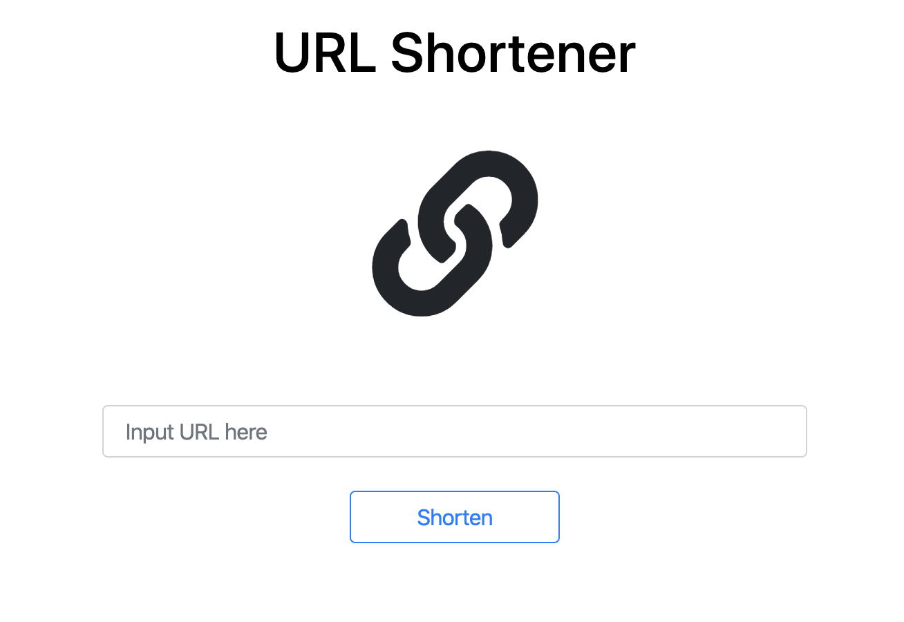
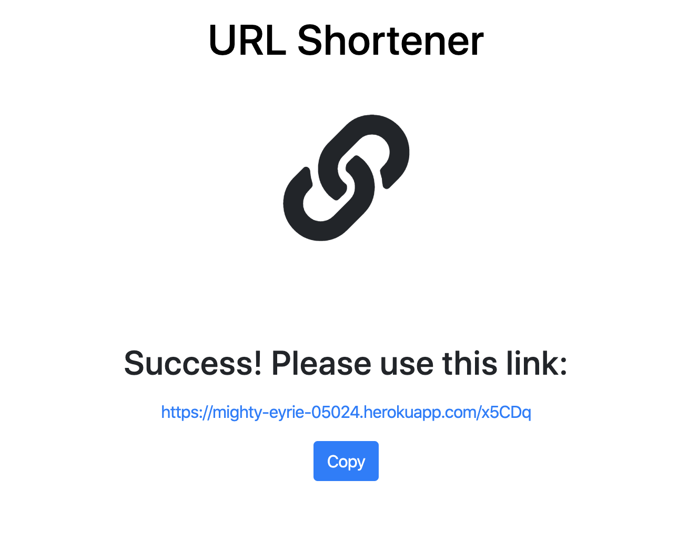

# URL Shortener (短網址產生器）

使用 Node.js + Express + MongoDB 打造的短網址產生器，可產生短網址導向原網頁。

## 環境建置與需求 (Prerequisites)

* [Node.js](https://nodejs.org/)
* [Express ^4.17.1](https://expressjs.com)
* [Express-Handlebars ^3.1.0](https://www.npmjs.com/package/express-handlebars)
* [Body-Parser ^1.19.0](https://www.npmjs.com/package/body-parser)
* [MongoDB ^4.0.13](https://www.mongodb.com/)
* [Mongoose ^5.7.10](https://mongoosejs.com/)
* [NanoID ^2.1.11](https://www.npmjs.com/package/nanoid)

## 安裝與執行步驟 (Installing and execution)

1.開啟終端機(Terminal)，clone到本機專案位置:

```
git clone https://github.com/bluesmy/url_shortener.git
```

2.切換至專案資料夾

```
cd url_shortener
```

3.安裝套件
```
npm install  //自動安裝package.json內套件
```

4.事先安裝完MongoDB後，啟動MongoDB伺服器

```
[~/mongodb/bin] ./mongod --dbpath ~/mongodb-data --bind_ip 127.0.0.1
```

5.啟動伺服器，並執行專案

```
npm run dev
```

6.當終端機顯示以下字樣，表示伺服器與資料庫已啟動並成功連結
`App is running!`

```
Ctrl + C *2  //連按兩下 Ctrl + C 關閉伺服器
```

瀏覽器輸入 [http://localhost:3000](http://localhost:3000) 即可開始使用。

## 功能描述 (Features)

- 使用者可輸入網址（含http:// 或https://)，產生可導向輸入網址之短網址
- 使用者可一鍵複製產生之短網址

## 專案畫面 (Screenshot)




## 專案使用工具 (Built With)

* [Visual Studio Code](https://code.visualstudio.com/) - The integrated development environment used
* [Express](https://expressjs.com) - The web framework used
* [Express-Handlebars](https://www.npmjs.com/package/express-handlebars) - The template engine used
* [Body-Parser](https://www.npmjs.com/package/body-parser) - Parse incoming request bodies in a middleware before handlers
* [MongoDB](https://www.mongodb.com/) - The database used
* [Mongoose](https://mongoosejs.com/) - ODM of MongoDB
* [NanoID](https://www.npmjs.com/package/nanoid) - Unique string ID generator

## 專案開發人員 (Contributor)

* **Sheri Su** - [bluesmy](https://github.com/bluesmy)
